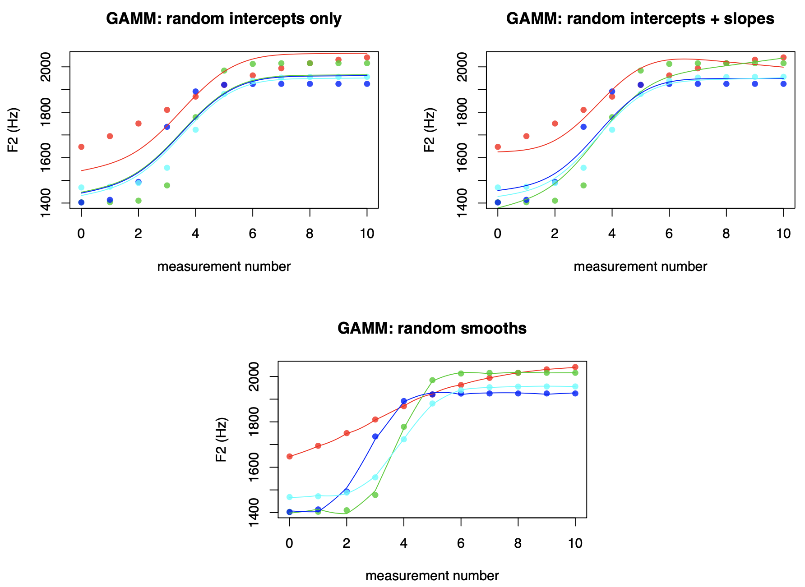
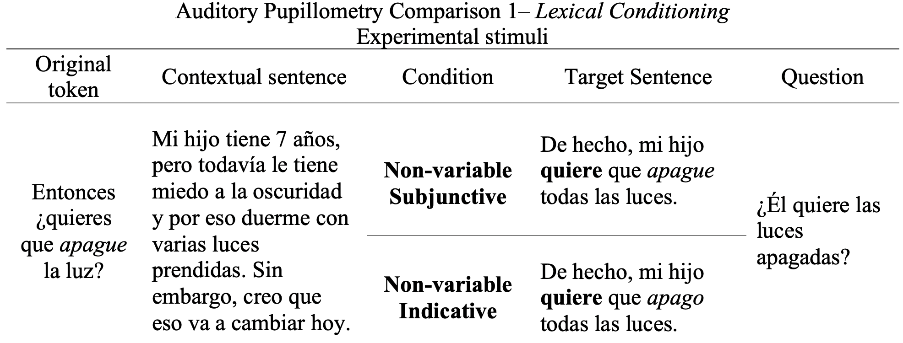
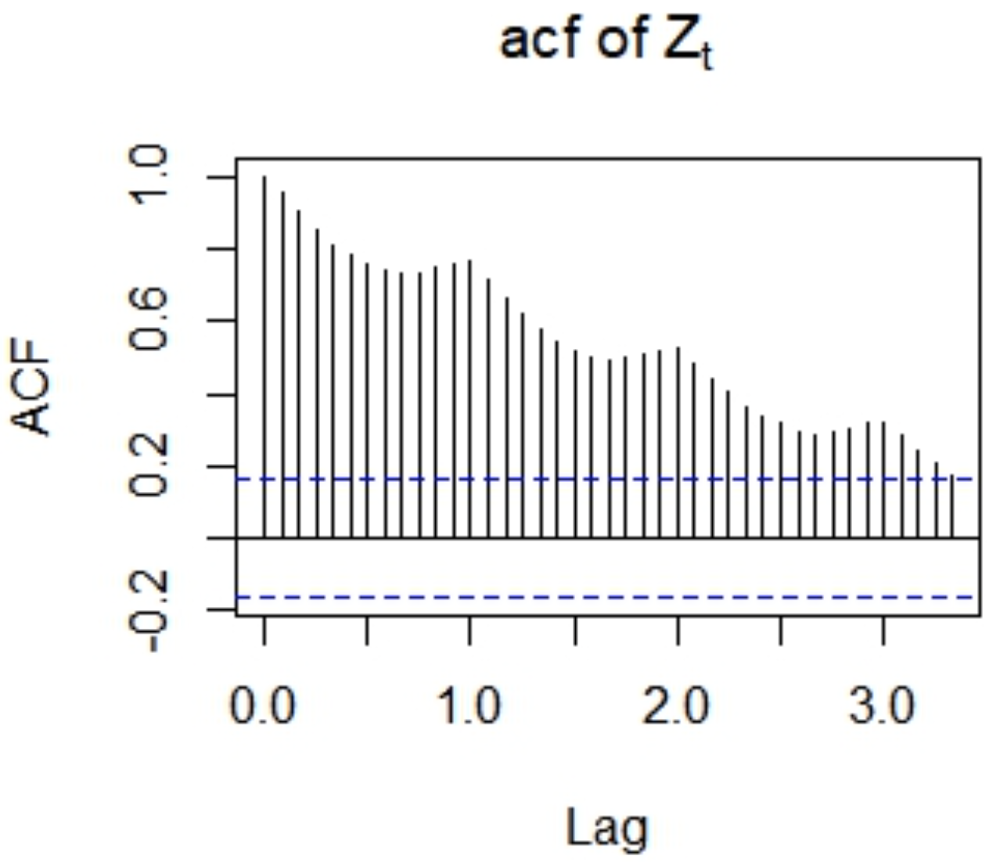

<style type="text/css">

body{ /* Normal  */
      font-family: "Times New Roman", Times, serif;
}
h1 { /* Header 1 */
  color: Black;
}
h3 { /* Header 2 */
  color: MidnightBlue;
}
h4 { /* Header 3 */
  color: CornflowerBlue;
  }
</style>
---
```{r, include=FALSE}
options(repos=c(CRAN="https://cran.gis-lab.info/"))
```

```{r, include=FALSE}
install.packages("tidyverse")
library(tidyverse)
```

# PART I

In this session, we will learn how to analyze *time series data*. to exemplify this, we will be analyzing pupillometry data.


First, what *is* time series data? 

Time course refers to the evolution of a measurement *over time*. *Time series* refers to data that form a sequence ordered in time. Therefore, you do a time course experiment and you analyze time series data. In our case, pupillometry is considered time series data because data on pupil dilation are collected continuously as the experiment unfolds such that we can obtain a dynamic, continuous measurement of pupil size over a period of time.

The method used to analyze time series data that we will learn is called *Generalized Linear Mixed Models* (GAMMs). A GAMM can be seen as a regression model which is able to model *non-linear patterns* in the data.

For example, we below that a regression line is unable to capture the non-linear nature of the F2 trajectory.

<br>

```{r, echo=FALSE, out.width = '30%', fig.show='hold'}
knitr::include_graphics(c("linear.jpeg", "nonlinear.jpeg"))
```

<br>

Let us refer to the slopes and intercepts of linear regression models as *parametric term*s. GAMMs differ from traditional linear regression models by allowing so-called *smooth terms* alongside parametric terms. Smooth terms are extremely flexible, that is how they can account for non-linear patterns.

Similar to linear mixed effects models, GAMMs incorporate random effects. These random effects can be random intercepts and random slopes. However, GAMMs also offer a third option: *random smooths.*

Random smooths are similar to random slopes, but they are more flexible than the latter: while random slopes can only capture by-group variation in linear effects, random smooths can also deal with by-group variation in non-linear effects.

<br>

```{r, echo=FALSE, out.width = '70%', fig.align="center"}

```

<br>

### The experiment: The Spanish Subjunctive

In Spanish, mood selection is primarily lexically conditioned, which entails that a number of verbs (*governors*) govern use of the subjunctive and indicative variants. A subset of these governors are *non-variable*, meaning that they select the subjunctive 100% pf the times (e.g., *querer*). This experiment investigates heritage speakers of Spanish sensitivity to this lexical constraint.

Lexical Conditioning Experiment

**1.	Condition Non-variable Subjunctive (NVS)** consists of a non-variable governor (in bold) followed by a subordinate verb in the subjunctive (in italics).

**2.	Condition Non-variable Indicative (NVI)** is comprised of a non-variable governor (in bold) followed by a subordinate verb in the indicative (in italics).

<br>

```{r, echo=FALSE, out.width = '70%', fig.align="center"}

```

<br>

**Hypothesis**
Condition NVI will elicit higher pupillary dilation in participants if they are sensitive to the lexical constraint that non-variable governors select the subjunctive categorically.

<br>

### How to design a GAMMs model

The main packages we will be using for GAMMs are `mgcv` to design models and `itsadug` to plot results.
```{r, include=FALSE}
install.packages("mgcv", repos = "http://cran.us.r-project.org")
library(mgcv)
```

After we load in the the data, we must make sure that *all* categorical variables are factors, otherwise the model won't run. Finally, we design our model. 
```{r, include=FALSE}
data <- read_csv("/Users/priscilalopez-beltran/Documents/Statistics workshop/data_pup.csv")  
```

```{r, include=FALSE}
# Create factors
data$participant <- as.factor(data$participant)
data$session <- as.factor(data$session)
data$condition <- as.factor(data$condition)
data$item <- as.factor(data$item)
data$regularity <- as.factor(data$regularity)
```

```{r, include=FALSE}
# Subset data frames:
target_NV <- droplevels(data[(data$condition == "NVS") | (data$condition == "NVI"), ])
```

We will use the `bam()` function to create our model.

```{r, message=FALSE, warning=FALSE}
NV <- bam(corrected_pupil_size ~ condition # fixed effects
             + s(bin, by = condition, k = 20) # smooth for time by condition
             + s(gaze_x, gaze_y) # smooth for gaze position
             + s(bin, participant, bs = 'fs', m = 1, k = 10) # factor smooth for time by participant
             + s(bin, item, bs = 'fs', m = 1, k = 10) # factor smooth for time by item
             , family = "scat" # t-distribution, as assumed in regression
             , data = target_NV # data
             , method = "fREML" # smoothing parameter estimation method fast REML
             , discrete = TRUE) # in Mike's words "set to discrete if you want it to converge in your lifetime"

summary(NV)
```

Let's dissect this scary output

#### Parametric coefficients

These are our fixed effects. As usual in regression, the intercept is the value of the dependent variable when all numerical predictors are equal to 0 and nominal variables are at their reference level. In  this case, the intercept represents the value of the DV for condition Non-Variable Indicative (NVI). We observe that for condition NVS, the pupillary dilation is -7.13 ties smaller than for NVI, which supports our hypothesis.

#### Random smooths

**1. edf**

The edf value is indicative of the amount of non-linearity of the smooth. If the edf value for a certain smooth is (close to) 1, this means that the pattern is (close to) linear, while a value greater than 1 indicates that the pattern is more complex (i.e. non-linear).

**2. Ref.df and F**

The Ref.df value is the reference number of degrees of freedom used for hypothesis testing (on the basis of the associated F-value)

**3. p-value**

The p-value associated with each smooth indicates if the smooth is significantly different from 0. In this case, all variables are highly significantly different fro 0. If we focus on the first two lines of coefficients, which are those of interest to us, we see that the p-value for NVI is much higher than for NVS, indicating a higher difference from 0.

#### Goodness-of-fit measures

The adjusted r2 represents the amount of variance explained by the regression and the deviance explained is a generalization of r2 and will be very similar to the actual r2. Bpth ofn them re pretty good in this model. Consider that with time series data, especially when we try to account for as much variability as possible, is is *very common* to see deviance explained values that are quite low. There is nothing inherently wrong with this, it is just a b-product of the type of data and models were are using.

<br>

While this may seem all easy peasy, significant p-values in the model don't really tell us much. We only know that both conditions are significantly different from zero,a nd we can kind of infer which one is more different, but in order to actually assess significance, we will need to visualize the results.

First, we visualize the smooths for NVI and NVS. On the Y axis we have pupillary dilation and on the X axis we have time. We see that NVI elicited higher dilation that NVS starting around time bin 5 (~100 ms into the target period).

<br>

```{r, include=FALSE}
install.packages("itsadug")
library(itsadug)
```

```{r, echo=FALSE, out.width = '50%'}
plot_smooth(NV, view = "bin", plot_all = c("condition"), 
            rm.ranef = TRUE, rug = FALSE, shade = FALSE, se = 0, lwd = 8,
            main = "Pupillary Response Smooths based on Fitted Values \nNon-variable Governors",
            xlab = "Time Bin (20ms per bin)",
            ylab = "Corrected Pupil Size",
            hide.label = T,
            family = "serif")
            #+ theme( legend.position = c(.95, .95), legend.justification = c("right"))
```
<br>

Next, we visualize the difference between smooths for NVI and NVS. The blocks of time marked my red dashed lines indicate when during the target period there was a significant difference between NVI and NVS. Because we are subtracting NVI from NVS and NVI elicited higer pupilary dilation, this difference is positive.

<br>

```{r, echo=FALSE, out.width = '50%'}
plot_diff(NV, view = "bin", comp = list(condition = c("NVI", "NVS")), rm.ranef = TRUE)
```

<br>

In all, by interpreting the model and the graphs produced, we can affirm that there was a significant differences between conditions which suggests that participants were sensitive to the lexical constraints of non-variable governors for mood selection.

<br>

If only the story would end here...

<br>

### Autocorrelation: AR(1) models

Autocorrelation in residuals is  a *big* problem in time series data because data points are *not independent* of one another, this means that the relationship between variances changes in a systematic way, rather than being random. We often see autocorrelation plots that look like the one below, with very high lag (autocorrelation) values. Autocorrelation is dangerous because it inflates Type I mistakes.

```{r, echo=FALSE, out.width = '30%', fig.align="center"}

```

<br>

In order to address this problem, we must prepare prepare our data to include a *first order autoregressive structure or AR(1).* 

```{r, message=FALSE, warning=FALSE}
# create a column called start.event
target_NV$start.event <- NULL

# Put everything in order in the time series data
target_NV <- droplevels(target_NV[order(target_NV$participant, target_NV$session, target_NV$trial, target_NV$bin),]) 

# Mark the start event of each trial (this will sigornagize the data)
target_NV <- start_event(target_NV, column = "bin", event = c("participant", "session", "trial"), order = FALSE) 

# Put everything BACK into the original order.
target_NV <- droplevels(target_NV[order(target_NV$participant, target_NV$session, target_NV$trial, target_NV$bin),]) 

# Obtain value or rho (autocorrelation statistic) for the original model
rho0 <- start_value_rho(NV)
```

<br>

Now we are ready to create our AR(1) model:
```{r, message=FALSE, warning=FALSE}
NV_AR1 <- bam(corrected_pupil_size ~ condition
             + s(bin, by = condition, k = 20) 
             + s(gaze_x, gaze_y) 
             + s(bin, participant, bs = 'fs', m = 1, k = 10) 
             + s(bin, item, bs = 'fs', m = 1, k = 10) 
             , family = "scat" 
             , data = target_NV 
             , method = "fREML" 
             , discrete = TRUE
             , AR.start = start.event
             , rho = 0.99)
```

<br>

By virtue of having included an AR(1) model we see that the autocorrelation in our NV_AR1 model is *very* low!
```{r, echo=FALSE, out.width= "50%"}
acf_resid(NV_AR1, split_pred = c("participant", "item"))
```

Let's see if our results have changed. They haven't changed much but now we can have much more confidence in them.
```{r}
summary(NV_AR1)
```

# PART 2

As was already mentioned, assessing significance is pretty difficult in GAMMs. Besides visualization, another possibility for significance testing is building a model with *binary difference smooths.* These model the difference between the two original smooths. Subsequently, we can assess if this difference smooth is found to be significant from the model itself, besides any further testing.

#### Binary difference smooths

To fit this new model, we first have to create a new, binary (i.e. dummy), variable which is equal to 0 for one level of the nominal variable and 1 for the other level. Below, we create the variable *IsInd* (is indicative) where the reference value 0 is subjunctive and the alternative value 1 is indicative

```{r}
target_NV$IsInd <- (target_NV$condition == "NVI")*1
```

<br>

Then we create an AR(1) model,
```{r, message=FALSE, warning= FALSE}
NV_Bin_AR1 <- bam(corrected_pupil_size ~
                             + s(bin, k = 20) # ref. level = subjunctive
                             + s(bin, by = IsInd, k = 20) # indicative - subjunctive
                             + s(gaze_x, gaze_y)
                             + s(bin, participant, bs = 'fs', m = 1, k = 10)
                             + s(bin, item, bs = 'fs', m = 1, k = 10)
                             , family = "scat"
                             , data = target_NV
                             , method = "fREML"
                             , discrete = TRUE
                             , AR.start = start.event
                             , rho = 0.99)
summary(NV_Bin_AR1)
```
#### Smooth terms

Here we need to pay attention to the second line 2, which models the difference between the non-linear patterns of NVI and NVS. We see that it indicates there is a significant difference between conditions.

#### Goodness-of-fit measures

Notice that with this more appropriate model, our deviance explained value has dropped drastically.

**IMPORTANT** 
Because is in this model there is *one* curve fitted to the difference between smooths,its visualization is a bit tricky. As of now, the practice is not fit a regular model first and use that visualization to support the binary prediction model.

### Interactions

Interactions are the trickiest part of designing a GAMM. Well first cover interactions with categorical variables and then we'll move on to continuous variables.

#### Interactions with categorical variables

The process will be fairly similar to the one above: we will first create a regular model in order to better visualize our results, and then we'll create a model with a binary difference smooth.

Here, we will learn how to create GAMM using *"Frankenvariables"*. A Frankenvariable is a crossover/intraction between two variables, such  that we obtain all possible permutations. For example if we have:

* Condition
  + NVS
  + NVI

* Regularity
  + Regular
  + Irregular

This crossover yields four levels:

* Frankenvariable Regularity:
  + NVS Regular
  + NVS Irregular
  + NVI Regular
  + NVI Irregular

This way we can examine the interaction between Condition and Regularity. Here, according to the extant literature, our prediction would be that irregular subordinate verbs would be less costly to process in th subjunctive.

```{r, message=FALSE}
target_NV$CondReg <- as.factor(interaction(target_NV$condition, target_NV$regularity))
```


```{r, message=FALSE, warning=FALSE}
NV_Reg_AR1 <- bam(corrected_pupil_size ~ CondReg
                          + s(bin, by = CondReg, k = 20)
                          + s(gaze_x, gaze_y)
                          + s(bin, participant, bs = 'fs', m = 1, k = 10)
                          + s(bin, item, bs = 'fs', m = 1, k = 10)
                          , family = "scat"
                          , data = target_NV
                          , method = "fREML"
                          , discrete = TRUE
                          , AR.start = start.event
                          , rho = 0.99)

summary(NV_Reg_AR1)
```

<br>

Let's plot the smooths:
```{r}
plot_smooth(NV_Reg_AR1, view = "bin", plot_all = c("CondReg"), 
            rm.ranef = TRUE, rug = FALSE, shade = FALSE, se = 0, lwd = 8,
            main = "Pupillary Response Smooths based on Fitted Values \nNon-variable Governors",
            xlab = "Time Bin (20ms per bin)",
            ylab = "Corrected Pupil Size",
            hide.label = T,
            family = "serif")
```
<br>

And now the difference smooths:
```{r}
plot_diff(NV_Reg_AR1, view = "bin", comp = list(CondReg = c("NVI.regular", "NVI.irregular")), rm.ranef = TRUE)
plot_diff(NV_Reg_AR1 , view = "bin", comp = list(CondReg = c("NVS.regular", "NVS.irregular")), rm.ranef = TRUE)

```


<br>

Once we have the model with the Frankenvariable, it is time to create a **binary difference smooth model**. We will actually be creating *two* models with different reference levels so that we can explore all levels of the interaction we are interested in.
```{r, message=FALSE}
# Create binary variables by Regularity
target_NV$IsInd <- (target_NV$condition == "NVI")*1 # Ref level subjunctive
target_NV$IsReg <- (target_NV$regularity == "regular")*1 # Ref level irregular
target_NV$IsIndReg <- (target_NV$condition == "NVI" & target_NV$regularity == "regular")*1 # NVS Reg - NVS Irreg
```
 
<br>

First, we create a model with *subjunctive irregular as reference level*:
```{r, message = FALSE, warning=FALSE}
NV_BinReg_AR1 <- bam(corrected_pupil_size ~
                                + s(bin, k = 20)
                                + s(bin, by = IsInd, k = 20)
                                + s(bin, by = IsReg, k = 20)
                                + s(bin, by = IsIndReg, k = 20)
                                + s(gaze_x, gaze_y)
                                + s(bin, participant, bs = 'fs', m = 1, k = 10)
                                + s(bin, item, bs = 'fs', m = 1, k = 10)
                                , family = "scat"
                                , data = target_NV
                                , method = "fREML"
                                , discrete = TRUE
                                , AR.start = start.event
                                , rho = 0.99)

summary(NV_BinReg_AR1)
```
<br>

Second, we create a model with *indicative regular as reference level*:
```{r, message=FALSE}
target_NV$IsSub <- (target_NV$condition == "NVS")*1 # indicative as reference level
target_NV$IsIrreg <- (target_NV$regularity == "irregular")*1 # regular as reference level
target_NV$IsSubIrreg <- (target_NV$condition == "NVS" & target_NV$regularity == "irregular")*1 # NVI Irreg - NVI Reg
```

```{r, message=FALSE, warning=FALSE}
NV_BinRegAR1_Ind <- bam(corrected_pupil_size ~
                                + s(bin, k = 20)
                                + s(bin, by = IsSub, k = 20)
                                + s(bin, by = IsIrreg, k = 20)
                                + s(bin, by = IsSubIrreg, k = 20)
                                + s(gaze_x, gaze_y)
                                + s(bin, participant, bs = 'fs', m = 1, k = 10)
                                + s(bin, item, bs = 'fs', m = 1, k = 10)
                                , family = "scat"
                                , data = target_NV
                                , method = "fREML"
                                , discrete = TRUE
                                , AR.start = start.event
                                , rho = 0.99)

summary(NV_BinRegAR1_Ind)
```

#### Interactions with continuous variables
 
 When fitting a model to examine an interaction with a continuous variable we need tensor product smooths, rather than binary difference smooths. For instance, explore the effects of profienciency on condition in GAMMs, the former need to be modeled as an interaction with *time*, given that time series data is being analyzed. 
 
Thus, the resulting non-linear interaction accounts for changes in pupil size caused by **proficiency on condition over time.**

```{r, message=FALSE, warning=FALSE}
NV_Prof_BPN <- bam(corrected_pupil_size ~ condition
             + te(bin, BPN_Sp, by = condition)
             + s(gaze_x, gaze_y)
             + s(bin, participant, bs = 'fs', m = 1, k = 10)
             + s(bin, item, bs = 'fs', m = 1, k = 10)
             , family = "scat"
             , data = target_NV
             , method = "fREML"
             , discrete = TRUE
             , AR.start = start.event
             , rho = 0.99)

summary(NV_Prof_BPN)
```

#### Visualization
In the case of interactions with continuous variables, visualization is essential to understand the results because it is the only method used to determine significance.

To visualize a two-dimensional pattern such as the effect of proficiency on condition over time, **contour plots** based on the model’s predictions have to be plotted. 

Here, the color bands represents the range of values of the dependent variable, in this case the difference in pupillary response between conditions (i.e., NIV minus NVS), the closer to red, the greater the difference. 

The highlighted areas in the plot indicate where there was a significant effect of the independent variable (y-axis) on the dependent variable, and the x-axis shows the time course of the effect. 

In addition, to further interpret the results observed, one-dimensional difference smooths can also be plotted in order to assess the magnitude, duration and time-course of the effects.

<br>

First, the contour plot:
```{r, echo=FALSE, message=FALSE, warning=FALSE}
plot_diff2(NV_Prof_BPN, view = c("bin", "BPN_Sp"),
           comp= list(condition = c("NVI", "NVS")),
           rm.ranef = T,
           show.diff = T,
           hide.label = T,
           main = "Difference between NVI minus NVS",
           xlab = "Time Bin (20ms per bin)",
           ylab = "BPN Reaction Times (ms)")
```

<br>

Then, the difference smooths:
```{r, echo=FALSE, message=FALSE, warning=FALSE}
par(mfcol = c(1, 2))
plot_diff(NV_Prof_BPN, view = "bin", 
          cond= list(BPN_Sp = 900),
          comp = list(condition = c("NVI", "NVS")),
          rm.ranef = TRUE,
          show.diff = T,
          hide.label = T,
          main = "Difference between NVI minus NVS \nHigh Profciency",
          xlab = "Time Bin (20ms per bin)",
          ylab = "Difference in corrected pupil size")

plot_diff(NV_Prof_BPN, view = "bin", 
          cond= list(BPN_Sp = 1500),
          comp = list(condition = c("NVI", "NVS")),
          rm.ranef = TRUE,
          show.diff = T,
          hide.label = T,
          main = "Difference between NVI minus NVS \nLow Proficiency",
          xlab = "Time Bin (20ms per bin)",
          ylab = "Difference in corrected pupil size")
```

#### Resources

* Readings
  +  Sóskuthy, M. (2017). Generalised additive mixed models for dynamic analysis in linguistics: a practical introduction
  + Wieling (2018) Analyzing dynamic phonetic data using generalized additive mixed modeling: A tutorial focusing on articulatory differences between L1 and L2 speakers of English
  + Schmidtke (2018) Pupillometry linguistic research: an introduction and review for L2 researchers
  + Sirois & Brisson (2015) Pupillometry
  
